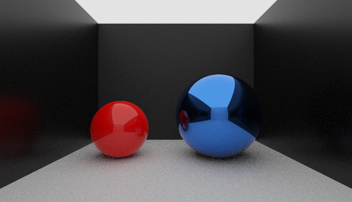
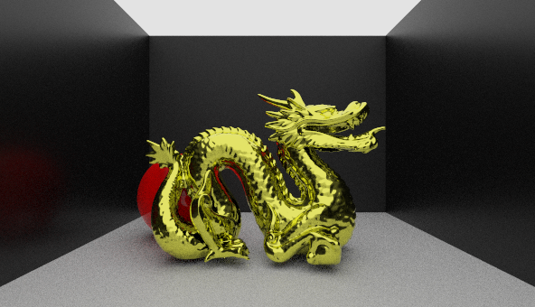

## What dis

A monte carlo path tracer utilizing cook-torrance physically based rendering.

## Features Implemented

- PBR Diffuse and Specular Rendering (Cook-Torrance)
- Cosine-Weighted Sampling Diffuse Sampling
- Aperture Sampling (Bokeh, Depth of Field)
- Acceleration Grid for Mesh Tracing (DDA)
- Progressive Tile Rendering

# Todo

- Implement multiple BRDF's
- Next Event Sampling
- MIS
- Volumetrics
- Texture Mapping
- Refraction

## Screenshots

500spp - 5 Bounces Max - Total Time: 375s [4 core i5]  

500spp - 5 Bounces Max - Total Time: 1000s [4 core i5]

## Future Work

While there is a lot to be worked on in the current version of the program, the next step forward is probably to go backwards and study raytracing techniques on a simpler BRDF. The complexity of the derivations for the PBR BRDF's is making it hard to move forward on more complex shading methods.
